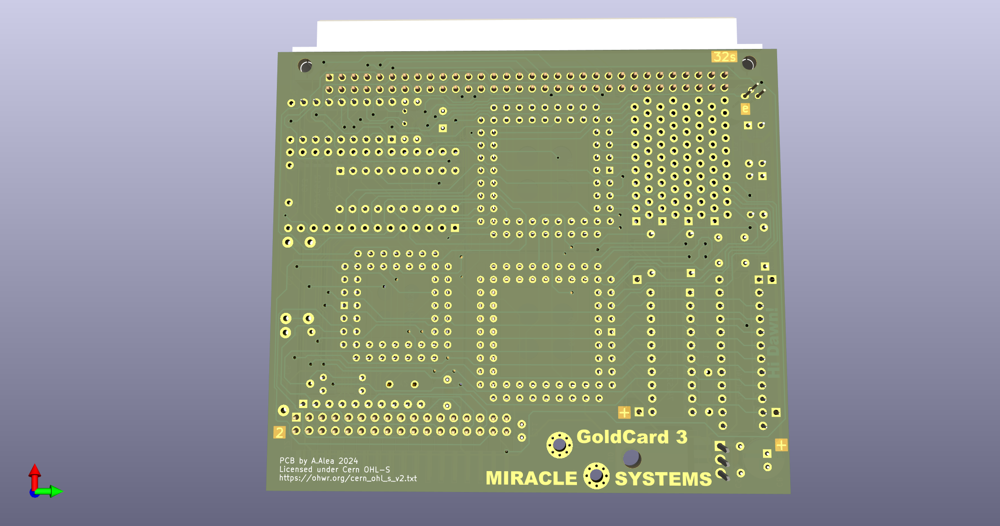

# QL_GoldCard
A reverse engineering exercice using the Sinclair QL GoldCard Expansion Card as target

Licensed under Cern OHL-S - https://ohwr.org/cern_ohl_s_v2.txt

## WARNING: DO NOT USE THIS PROJECT IS NOT TESTED AND MISSING THINGS
This is not a functional item, it's only a exercice of reverse engineering to reinforce my skills in Kicad EDA Software.

This project match schematics found on internet, and pictures of the real interface.

* There is no know source of the JEDEC file for the Altera's CPLD
* Some IC can be deprecated and not found on market.
* No information about original has 2 or 4 copper layer, I must use 4, as I was not able to do it in only 2.

Anyway:
* There is not error or warning on the PCB and Schematics
* Schematics seen to be good
* Copper side match 1:1 pictures of internet.

* If you take the risk and do one and it work, please let me know.
* If you have the source of JEDEC file for the CPLD, please let me know.
* If you found any error in the schematic or PLC, please, let me know.

## The GoldCard Board
This card is a upgrade of the Sinclair QL computer from 1985, it provide a 68000 processor running a 16Mhz and with a bus wide of 16bit, against original 68008, 7,5Mhz and 8bits bus wide.

Provide Aditional 1920Mb of Ram (16bits) of 2048Mb installed. (128Kb are used as shadow Rom)

Include a up to 4 disk drive (2 + 2 with a add-on card) compatible with 720Kb, 1.44Mb and 2.88Mb (up to 3.2Mb depend of the format)

It have a Real Time Clock.

This was later superseded by the SuperGoldCard, that use a 68020 and 4Mb of Ram.

## Comparative

