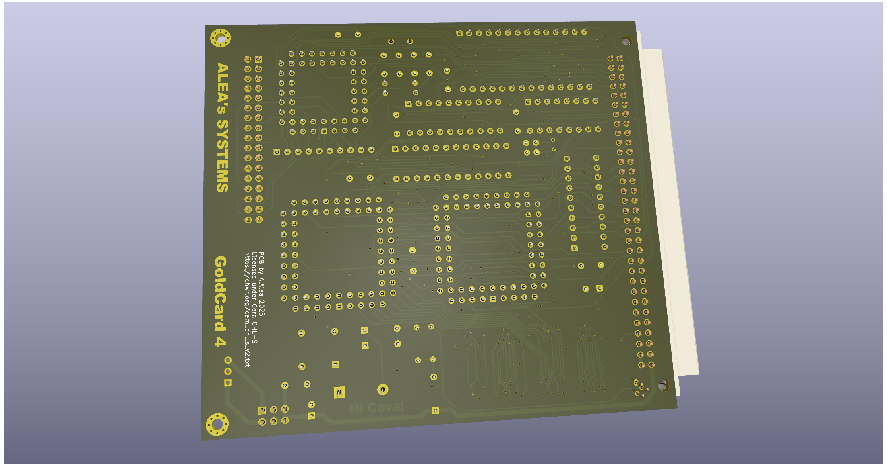

# QL GoldCard (Alea's Version)
A reverse engineering exercice using the Sinclair QL GoldCard Expansion Card as target

Licensed under Cern OHL-S - https://ohwr.org/cern_ohl_s_v2.txt

(The 3D Model of the PLCC chips is work of Zerover)

## WARNING: DO NOT USE THIS PROJECT IS NOT TESTED AND MISSING THINGS
This is not a functional item, it's only a exercice of reverse engineering to reinforce my skills in Kicad EDA Software.

* Use memory SIP-24 easy to found.
* No IC over IC
* small but in market battery socket
* 9V/5V jumpers for use with aurora or backplanes.

